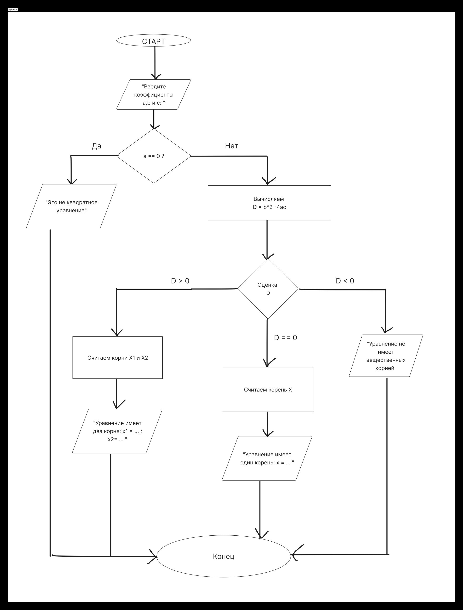

# Решение квадратного уравнения

---

## Условие задачи

Написать программу на языке **C**, которая решает квадратное уравнение:

$$
a x^2 + b x + c = 0
$$

и выводит результат на **английском языке**.

**Входные данные:**  
Три вещественных числа `a b c`, введённые через пробел.

**Выходные данные:**
1. Если $a = 0$ — это не квадратное уравнение.
2. Если $a \neq 0$, вычисляется дискриминант $D = b^2 - 4ac$:
    - при $D > 0$ — два действительных корня;
    - при $D = 0$ — один (двукратный) корень;
    - при $D < 0$ — действительных корней нет.

---

## Теоретический раздел

Квадратное уравнение имеет вид:

$$
a x^2 + b x + c = 0, \quad a \neq 0
$$

Ключевая величина — **дискриминант**:

$$
D = b^2 - 4ac
$$

Рассмотрим возможные случаи:

1. **Если $D > 0$**, уравнение имеет два различных корня:
   $$
   x_1 = \frac{-b + \sqrt{D}}{2a}, \quad x_2 = \frac{-b - \sqrt{D}}{2a}
   $$

2. **Если $D = 0$**, уравнение имеет один корень:
   $$
   x = \frac{-b}{2a}
   $$

3. **Если $D < 0$**, уравнение не имеет действительных корней (корни будут комплексными).

> 💡 Если $a = 0$, уравнение вырождается в **линейное**:
$$
b x + c = 0
$$
> Тогда:
> - при $b \neq 0$ — $x = -\frac{c}{b}$, одно решение;
> - при $b = 0, c = 0$ — решений бесконечно много;
> - при $b = 0, c \neq 0$ — решений нет.

---

## Алгоритм программы

### Блок-схема


### Описание шагов

1. Считать с клавиатуры коэффициенты $a, b, c$.
2. Проверить, является ли уравнение квадратным ($a \neq 0$).
3. Если $a = 0$ — вывести сообщение «Это не квадратное уравнение».
4. Иначе вычислить дискриминант $D = b^2 - 4ac$.
5. В зависимости от $D$:
    - если $D > 0$, найти два корня;
    - если $D = 0$, найти один корень;
    - если $D < 0$, вывести сообщение об отсутствии действительных решений.
6. Вывести результаты на экран.

---

## Код программы

```c
#include <stdio.h>  // для ввода-вывода 
#include <math.h>   // для функции sqrt()

int main() {
    double a, b, c;   // коэффициенты уравнения
    double D;         // дискриминант
    double x1, x2;    // корни

    // --- Ввод коэффициентов --- 
    printf("Enter coefficients a, b, c: ");
    scanf("%lf %lf %lf", &a, &b, &c);

    // --- Проверка: a не равно 0 ---
    if (a == 0) {
        printf("This is not a quadratic equation (a = 0)!\n");
        return 0;
    }

    // --- Вычисляем дискриминант ---
    D = b * b - 4 * a * c;

    // --- Анализ дискриминанта ---
    if (D > 0) {
        x1 = (-b + sqrt(D)) / (2 * a);
        x2 = (-b - sqrt(D)) / (2 * a);
        printf("The equation has two real roots: x1 = %.2lf, x2 = %.2lf\n", x1, x2);
    }
    else if (D == 0) {
        x1 = -b / (2 * a);
        printf("The equation has one real root: x = %.2lf\n", x1);
    }
    else {
        printf("The equation has no real roots (D < 0)\n");
    }

    return 0;
}
```

---

## Примеры для тестирования

**Пример 1.**
```
Enter coefficients a, b, c: 1 -3 2
The equation has two real roots: x1 = 2.00, x2 = 1.00
```

**Пример 2.**
```
Enter coefficients a, b, c: 1 2 1
The equation has one real root: x = -1.00
```

**Пример 3.**
```
Enter coefficients a, b, c: 1 0 1
The equation has no real roots (D < 0)
```

**Пример 4.**
```
Enter coefficients a, b, c: 0 4 -8
This is not a quadratic equation (a = 0)!
```
